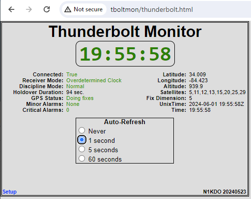
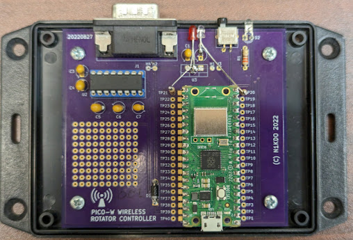

# N1KDO's Thunderbolt Monitor

## What it is

This is a simple IOT device to monitor the state of a Trimble Thunderbolt
GPS Disciplined Oscillator.

People have made interesting UIs for the Thunderbolt.  This project is not
that.  The goal here is to have a very simple UI using Go/No-Go LED, as
well as a simple Web UI that shows the basic status of the device.

There is a Green LED that lights up when the 10 MHz oscillator is under 
_discipline_, and a Red LED that lights up when no TSIP traffic has been
received from the Thunderbolt for more than a few seconds.

If the Green "disciplined" LED is lit, the 10 MHz time base is GPS 
disciplined.

## Hardware

This is built on the same hardware as my 
[Rotator-Controller-Controller](https://github.com/n1kdo/rotator-controller-controller),
it has two added LEDs on GP15 (green, 10 MHz disciplined when lit) and 
GP16 (red LED indicates that the Thunderbolt cannot be heard sending data.)

The Trimble Thunderbolt was modified to provide +5 VDC on Pin 1 of its serial
port.  The Rotator-Controller-Controller hardware already has support for 
leeching power from another device on Pin 1.

## How it works

The Thunderbolt emits several TSIP messages every second.  The software 
running on the Pico-W reads and parses those messages.  The most 
important values retrieved are the "minor alarms", "discipline mode",
and various time and date data.  The software enables the green 
"Disciplined" LED when the "Discipline Mode" is "Normal."  The software 
enables the red "comms fail" LED if it has not received any TSIP packets
from the Thunderbolt for a few seconds.

